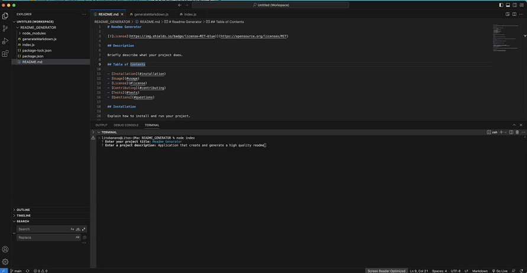
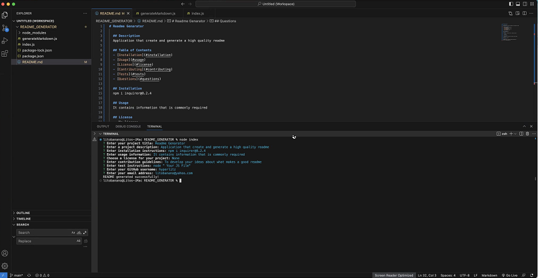

# Readme Generator

## Description

Briefly describe what your project does.

## Table of Contents

- [Installation](#installation)
- [Usage](#usage)
- [License](#license)
- [Contributing](#contributing)
- [Tests](#tests)
- [Questions](#questions)

## Installation

Explain how to install and run your project.

## Usage

Provide instructions on how to use your project.

## License

This project is licensed under the [MIT License](https://opensource.org/licenses/MIT).

## Contributing

Explain how others can contribute to your project.

## Tests

Provide information about how to run tests.

## Questions

For questions or feedback, you can reach me through:
- Repository: (https://github.com/hyperlitz/README_GENERATOR)
- Email: litobanano@yahoo.com

## Walkthrough Video

[Link to walkthrough video](https://app.screencastify.com/manage/videos/bqgGUFo194MK61uFtubF)

## Screenshots

